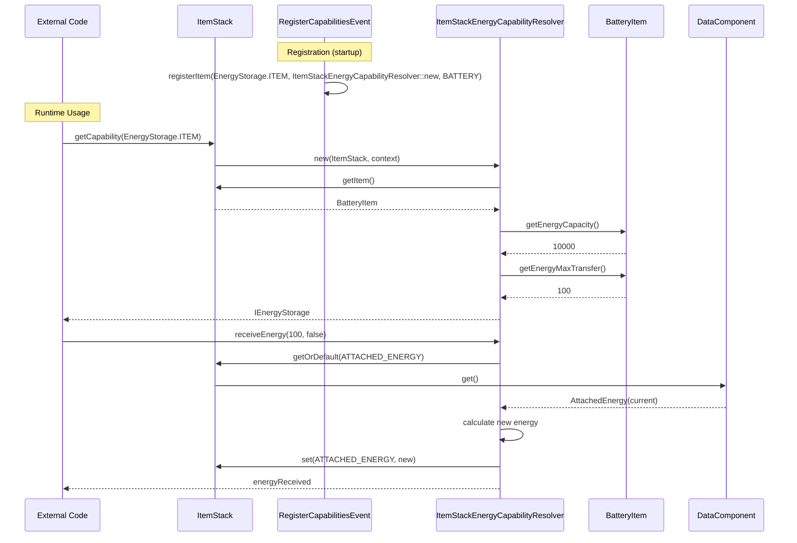

# Capability System UML

## Class Diagram

```mermaid
classDiagram
    direction TB

    %% NeoForge Interfaces
    class IEnergyStorage {
        <<interface>>
        +receiveEnergy(int, boolean) int
        +extractEnergy(int, boolean) int
        +getEnergyStored() int
        +getMaxEnergyStored() int
        +canExtract() boolean
        +canReceive() boolean
    }

    class IItemHandler {
        <<interface>>
        +getSlots() int
        +getStackInSlot(int) ItemStack
        +insertItem(int, ItemStack, boolean) ItemStack
        +extractItem(int, int, boolean) ItemStack
        +getSlotLimit(int) int
        +isItemValid(int, ItemStack) boolean
    }

    class IFluidHandler {
        <<interface>>
        +getTanks() int
        +getFluidInTank(int) FluidStack
        +getTankCapacity(int) int
        +isFluidValid(int, FluidStack) boolean
        +fill(FluidStack, FluidAction) int
        +drain(FluidStack, FluidAction) FluidStack
    }

    %% Holder Interfaces
    class IEnergyHolder {
        <<interface>>
        +getEnergyCapacity() int
        +getEnergyMaxTransfer() int
    }

    class IItemHolder {
        <<interface>>
        +getSlots() int
        +getLimit() int
    }

    class IFluidHolder {
        <<interface>>
        +getTanks() int
        +getCapacity() int
        +getValidator() BiPredicate
    }

    %% Base Resolver
    class CapabilityResolver~HOLDER,CONTEXT,ATTACHED~ {
        <<abstract>>
        -parent: HOLDER
        -component: DataComponentType~ATTACHED~
        -context: CONTEXT
        -canInsert: Predicate~CONTEXT~
        -canExtract: Predicate~CONTEXT~
        #getAttached(ATTACHED) ATTACHED
        #setAttached(ATTACHED) void
        #getParent() HOLDER
        #canInsert() boolean
        #canExtract() boolean
    }

    %% Type-Specific Resolvers
    class EnergyCapabilityResolver~HOLDER,CONTEXT~ {
        -capacity: int
        -maxTransfer: int
        +receiveEnergy(int, boolean) int
        +extractEnergy(int, boolean) int
        #setEnergy(int) void
    }

    class ItemCapabilityResolver~HOLDER,CONTEXT~ {
        -slots: int
        -limit: int
        +getSlots() int
        +insertItem(int, ItemStack, boolean) ItemStack
        +extractItem(int, int, boolean) ItemStack
    }

    class FluidCapabilityResolver~HOLDER,CONTEXT~ {
        -tanks: int
        -capacity: int
        -validator: BiPredicate
        +fill(FluidStack, FluidAction) int
        +drain(FluidStack, FluidAction) FluidStack
    }

    %% ItemStack Resolvers
    class ItemStackEnergyCapabilityResolver {
        +ItemStackEnergyCapabilityResolver(ItemStack, Void)
    }

    class ItemStackItemCapabilityResolver {
        +ItemStackItemCapabilityResolver(ItemStack, Void)
    }

    class ItemStackFluidCapabilityResolver {
        +ItemStackFluidCapabilityResolver(ItemStack, Void)
    }

    %% Inheritance
    CapabilityResolver <|-- EnergyCapabilityResolver
    CapabilityResolver <|-- ItemCapabilityResolver
    CapabilityResolver <|-- FluidCapabilityResolver

    EnergyCapabilityResolver <|-- ItemStackEnergyCapabilityResolver
    ItemCapabilityResolver <|-- ItemStackItemCapabilityResolver
    FluidCapabilityResolver <|-- ItemStackFluidCapabilityResolver

    %% Interface Implementation
    EnergyCapabilityResolver ..|> IEnergyStorage
    ItemCapabilityResolver ..|> IItemHandler
    FluidCapabilityResolver ..|> IFluidHandler
```

## Sequence Diagram - Capability Resolution

```mermaid
sequenceDiagram
    participant Client as External Code
    participant ItemStack
    participant Event as RegisterCapabilitiesEvent
    participant Resolver as ItemStackEnergyCapabilityResolver
    participant Item as BatteryItem
    participant Component as DataComponent

    Note over Event: Registration (startup)
    Event->>Event: registerItem(EnergyStorage.ITEM, ItemStackEnergyCapabilityResolver::new, BATTERY)

    Note over Client: Runtime Usage
    Client->>ItemStack: getCapability(EnergyStorage.ITEM)
    ItemStack->>Resolver: new(ItemStack, context)
    Resolver->>ItemStack: getItem()
    ItemStack-->>Resolver: BatteryItem
    Resolver->>Item: getEnergyCapacity()
    Item-->>Resolver: 10000
    Resolver->>Item: getEnergyMaxTransfer()
    Item-->>Resolver: 100
    Resolver-->>Client: IEnergyStorage

    Client->>Resolver: receiveEnergy(100, false)
    Resolver->>ItemStack: getOrDefault(ATTACHED_ENERGY)
    ItemStack->>Component: get()
    Component-->>Resolver: AttachedEnergy(current)
    Resolver->>Resolver: calculate new energy
    Resolver->>ItemStack: set(ATTACHED_ENERGY, new)
    Resolver-->>Client: energyReceived
```