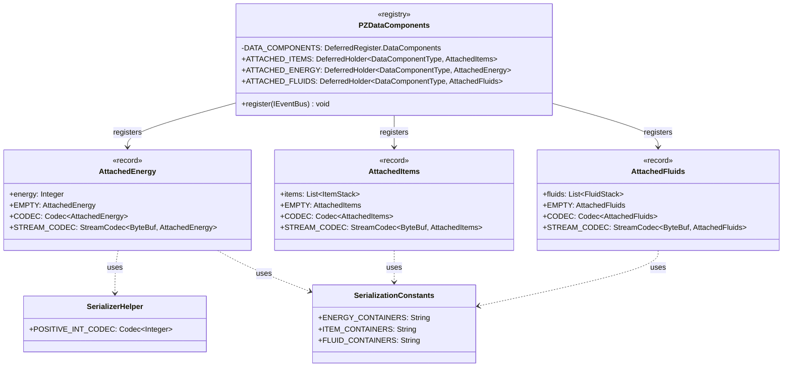
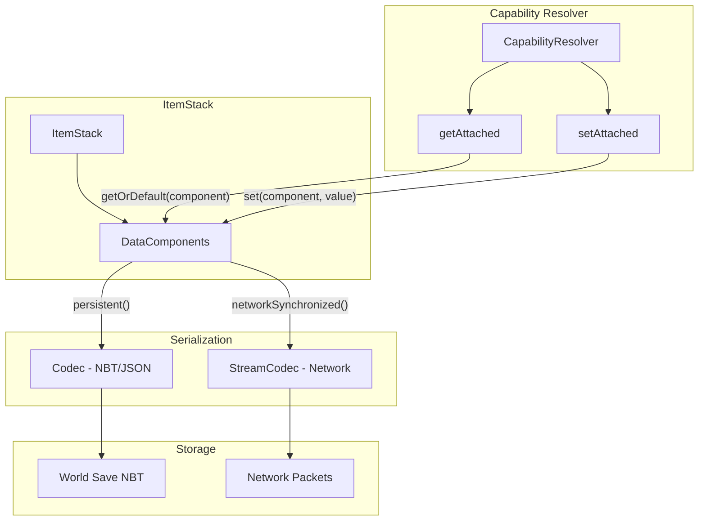

# Data Components UML

## Class Diagram

```mermaid
classDiagram
    direction TB

    %% Registry
    class PZDataComponents {
        <<registry>>
        -DATA_COMPONENTS: DeferredRegister.DataComponents
        +ATTACHED_ITEMS: DeferredHolder~DataComponentType, AttachedItems~
        +ATTACHED_ENERGY: DeferredHolder~DataComponentType, AttachedEnergy~
        +ATTACHED_FLUIDS: DeferredHolder~DataComponentType, AttachedFluids~
        +register(IEventBus) void
    }

    %% Data Containers
    class AttachedEnergy {
        <<record>>
        +energy: Integer
        +EMPTY: AttachedEnergy
        +CODEC: Codec~AttachedEnergy~
        +STREAM_CODEC: StreamCodec~ByteBuf, AttachedEnergy~
    }

    class AttachedItems {
        <<record>>
        +items: List~ItemStack~
        +EMPTY: AttachedItems
        +CODEC: Codec~AttachedItems~
        +STREAM_CODEC: StreamCodec~ByteBuf, AttachedItems~
    }

    class AttachedFluids {
        <<record>>
        +fluids: List~FluidStack~
        +EMPTY: AttachedFluids
        +CODEC: Codec~AttachedFluids~
        +STREAM_CODEC: StreamCodec~ByteBuf, AttachedFluids~
    }

    %% Serialization Helpers
    class SerializerHelper {
        +POSITIVE_INT_CODEC: Codec~Integer~
    }

    class SerializationConstants {
        +ENERGY_CONTAINERS: String
        +ITEM_CONTAINERS: String
        +FLUID_CONTAINERS: String
    }

    %% Relationships
    PZDataComponents --> AttachedEnergy : registers
    PZDataComponents --> AttachedItems : registers
    PZDataComponents --> AttachedFluids : registers

    AttachedEnergy ..> SerializerHelper : uses
    AttachedEnergy ..> SerializationConstants : uses
    AttachedItems ..> SerializationConstants : uses
    AttachedFluids ..> SerializationConstants : uses
```

## Data Flow

```mermaid
flowchart TB
    subgraph "ItemStack"
        IS[ItemStack]
        DC[DataComponents]
    end

    subgraph "Capability Resolver"
        CR[CapabilityResolver]
        GA[getAttached]
        SA[setAttached]
    end

    subgraph "Serialization"
        CODEC[Codec - NBT/JSON]
        STREAM[StreamCodec - Network]
    end

    subgraph "Storage"
        NBT[World Save NBT]
        NET[Network Packets]
    end

    IS --> DC
    CR --> GA
    CR --> SA
    GA --> |"getOrDefault(component)"| DC
    SA --> |"set(component, value)"| DC

    DC --> |"persistent()"| CODEC
    DC --> |"networkSynchronized()"| STREAM

    CODEC --> NBT
    STREAM --> NET
```