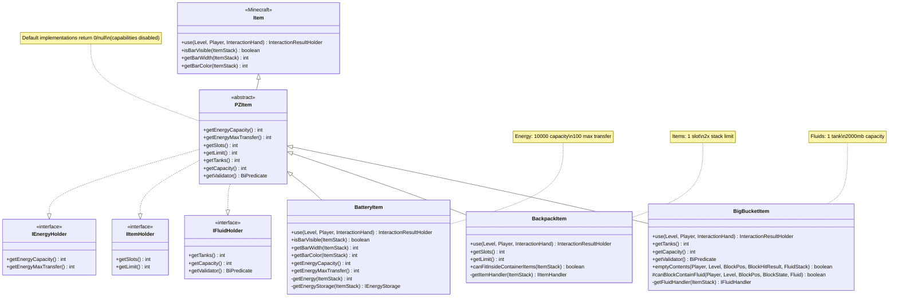
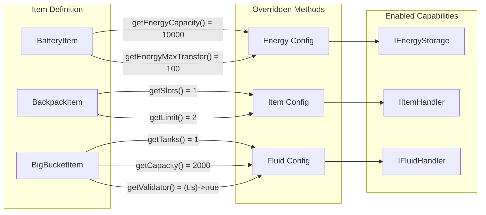

# Items UML

## Class Diagram

```mermaid
classDiagram
    direction TB

    %% Minecraft Base
    class Item {
        <<Minecraft>>
        +use(Level, Player, InteractionHand) InteractionResultHolder
        +isBarVisible(ItemStack) boolean
        +getBarWidth(ItemStack) int
        +getBarColor(ItemStack) int
    }

    %% Holder Interfaces
    class IEnergyHolder {
        <<interface>>
        +getEnergyCapacity() int
        +getEnergyMaxTransfer() int
    }

    class IItemHolder {
        <<interface>>
        +getSlots() int
        +getLimit() int
    }

    class IFluidHolder {
        <<interface>>
        +getTanks() int
        +getCapacity() int
        +getValidator() BiPredicate
    }

    %% PZItem Base
    class PZItem {
        <<abstract>>
        +getEnergyCapacity() int
        +getEnergyMaxTransfer() int
        +getSlots() int
        +getLimit() int
        +getTanks() int
        +getCapacity() int
        +getValidator() BiPredicate
    }

    %% Concrete Items
    class BatteryItem {
        +use(Level, Player, InteractionHand) InteractionResultHolder
        +isBarVisible(ItemStack) boolean
        +getBarWidth(ItemStack) int
        +getBarColor(ItemStack) int
        +getEnergyCapacity() int
        +getEnergyMaxTransfer() int
        -getEnergy(ItemStack) int
        -getEnergyStorage(ItemStack) IEnergyStorage
    }

    class BackpackItem {
        +use(Level, Player, InteractionHand) InteractionResultHolder
        +getSlots() int
        +getLimit() int
        +canFitInsideContainerItems(ItemStack) boolean
        -getItemHandler(ItemStack) IItemHandler
    }

    class BigBucketItem {
        +use(Level, Player, InteractionHand) InteractionResultHolder
        +getTanks() int
        +getCapacity() int
        +getValidator() BiPredicate
        +emptyContents(Player, Level, BlockPos, BlockHitResult, FluidStack) boolean
        #canBlockContainFluid(Player, Level, BlockPos, BlockState, Fluid) boolean
        -getFluidHandler(ItemStack) IFluidHandler
    }

    %% Inheritance
    Item <|-- PZItem
    PZItem ..|> IEnergyHolder
    PZItem ..|> IItemHolder
    PZItem ..|> IFluidHolder

    PZItem <|-- BatteryItem
    PZItem <|-- BackpackItem
    PZItem <|-- BigBucketItem

    %% Notes
    note for PZItem "Default implementations return 0/null\n(capabilities disabled)"
    note for BatteryItem "Energy: 10000 capacity\n100 max transfer"
    note for BackpackItem "Items: 1 slot\n2x stack limit"
    note for BigBucketItem "Fluids: 1 tank\n2000mb capacity"
```

## Item Capability Configuration

```mermaid
flowchart LR
    subgraph "Item Definition"
        BI[BatteryItem]
        BAI[BackpackItem]
        BBI[BigBucketItem]
    end

    subgraph "Overridden Methods"
        BI --> |"getEnergyCapacity() = 10000"| EC[Energy Config]
        BI --> |"getEnergyMaxTransfer() = 100"| EC

        BAI --> |"getSlots() = 1"| IC[Item Config]
        BAI --> |"getLimit() = 2"| IC

        BBI --> |"getTanks() = 1"| FC[Fluid Config]
        BBI --> |"getCapacity() = 2000"| FC
        BBI --> |"getValidator() = (t,s)->true"| FC
    end

    subgraph "Enabled Capabilities"
        EC --> ES[IEnergyStorage]
        IC --> IH[IItemHandler]
        FC --> FH[IFluidHandler]
    end
```