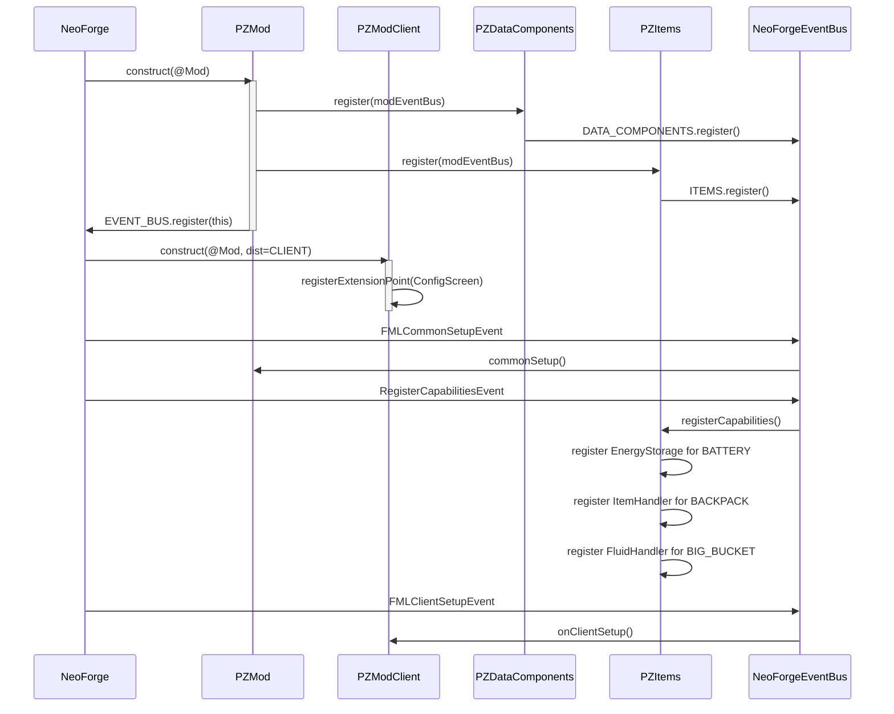

# Module Overview UML

## Package Diagram

```mermaid
flowchart TB
    subgraph pl.pzmod
        PZMod[PZMod]
        PZModClient[PZModClient]
        Config[Config]
    end

    subgraph pl.pzmod.registries
        PZItems[PZItems]
        PZDataComponents[PZDataComponents]
    end

    subgraph pl.pzmod.items
        PZItem[PZItem]
        BatteryItem[BatteryItem]
        BackpackItem[BackpackItem]
        BigBucketItem[BigBucketItem]
    end

    subgraph pl.pzmod.capabilities
        CapabilityResolver[CapabilityResolver]

        subgraph energy
            IEnergyHolder[IEnergyHolder]
            EnergyCapabilityResolver[EnergyCapabilityResolver]
            ItemStackEnergyCapabilityResolver[ItemStackEnergyCapabilityResolver]
        end

        subgraph item
            IItemHolder[IItemHolder]
            ItemCapabilityResolver[ItemCapabilityResolver]
            ItemStackItemCapabilityResolver[ItemStackItemCapabilityResolver]
        end

        subgraph fluid
            IFluidHolder[IFluidHolder]
            FluidCapabilityResolver[FluidCapabilityResolver]
            ItemStackFluidCapabilityResolver[ItemStackFluidCapabilityResolver]
        end
    end

    subgraph pl.pzmod.data
        SerializerHelper[SerializerHelper]
        SerializationConstants[SerializationConstants]

        subgraph containers
            AttachedEnergy[AttachedEnergy]
            AttachedItems[AttachedItems]
            AttachedFluids[AttachedFluids]
        end
    end

    %% Dependencies
    PZMod --> PZItems
    PZMod --> PZDataComponents
    PZMod --> Config

    PZItems --> BatteryItem
    PZItems --> BackpackItem
    PZItems --> BigBucketItem
    PZItems --> ItemStackEnergyCapabilityResolver
    PZItems --> ItemStackItemCapabilityResolver
    PZItems --> ItemStackFluidCapabilityResolver

    PZItem --> IEnergyHolder
    PZItem --> IItemHolder
    PZItem --> IFluidHolder

    EnergyCapabilityResolver --> CapabilityResolver
    ItemCapabilityResolver --> CapabilityResolver
    FluidCapabilityResolver --> CapabilityResolver

    EnergyCapabilityResolver --> AttachedEnergy
    ItemCapabilityResolver --> AttachedItems
    FluidCapabilityResolver --> AttachedFluids

    PZDataComponents --> AttachedEnergy
    PZDataComponents --> AttachedItems
    PZDataComponents --> AttachedFluids
```

## Initialization Sequence

```mermaid
sequenceDiagram
    participant NeoForge
    participant PZMod
    participant PZModClient
    participant PZDataComponents
    participant PZItems
    participant NeoForgeEventBus

    NeoForge->>PZMod: construct(@Mod)
    activate PZMod
    PZMod->>PZDataComponents: register(modEventBus)
    PZDataComponents->>NeoForgeEventBus: DATA_COMPONENTS.register()
    PZMod->>PZItems: register(modEventBus)
    PZItems->>NeoForgeEventBus: ITEMS.register()
    PZMod->>NeoForge: EVENT_BUS.register(this)
    deactivate PZMod

    NeoForge->>PZModClient: construct(@Mod, dist=CLIENT)
    activate PZModClient
    PZModClient->>PZModClient: registerExtensionPoint(ConfigScreen)
    deactivate PZModClient

    NeoForge->>NeoForgeEventBus: FMLCommonSetupEvent
    NeoForgeEventBus->>PZMod: commonSetup()

    NeoForge->>NeoForgeEventBus: RegisterCapabilitiesEvent
    NeoForgeEventBus->>PZItems: registerCapabilities()
    PZItems->>PZItems: register EnergyStorage for BATTERY
    PZItems->>PZItems: register ItemHandler for BACKPACK
    PZItems->>PZItems: register FluidHandler for BIG_BUCKET

    NeoForge->>NeoForgeEventBus: FMLClientSetupEvent
    NeoForgeEventBus->>PZModClient: onClientSetup()
```